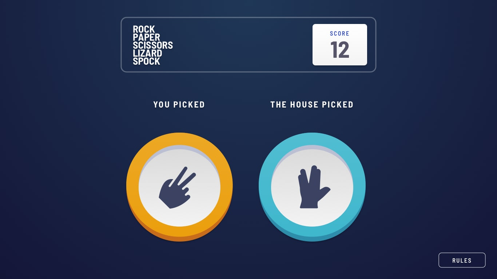

# Frontend Mentor - Rock, Paper, Scissors solution

This is a solution to the [Rock, Paper, Scissors challenge on Frontend Mentor](https://www.frontendmentor.io/challenges/rock-paper-scissors-game-pTgwgvgH). Frontend Mentor challenges help you improve your coding skills by building realistic projects. 

## Table of contents

- [Overview](#overview)
  - [The challenge](#the-challenge)
  - [Screenshots](#screenshots)
  - [Links](#links)
- [My process](#my-process)
  - [Built with](#built-with)
  - [Useful resources](#useful-resources)
- [Acknowledgements](#acknowledgements)
- [Author](#author)

## Overview

### The challenge

Users should be able to:

- View the optimal layout for the game depending on their device's screen size
- Play Rock, Paper, Scissors against the computer
- Maintain the state of the score after refreshing the browser _(optional)_
- **Bonus**: Play Rock, Paper, Scissors, Lizard, Spock against the computer _(optional)_

Not sure what Rock, Paper, Scissors, Lizard, Spock is? [Check out this clip from The Big Bang Theory](https://www.youtube.com/watch?v=iSHPVCBsnLw).

### Screenshots

  
   

  
  
  
  

  
  
  
  
  
  

### Links

- Solution URL: 
- Live Site URL: [https://frontend-mentor-rock-paper-scissors-self.vercel.app/](https://frontend-mentor-rock-paper-scissors-self.vercel.app/)
- All Solutions URL: [https://frontend-mentor-solutions-mu.vercel.app/](https://frontend-mentor-solutions-mu.vercel.app/)

## My process

### Built with

  
  
  
    

### Useful resources

- [Window: localStorage property](https://developer.mozilla.org/en-US/docs/Web/API/Window/localStorage)
- [radial-gradient()](https://developer.mozilla.org/en-US/docs/Web/CSS/gradient/radial-gradient)
- [box-shadow](https://developer.mozilla.org/en-US/docs/Web/CSS/box-shadow)
- [Animation](https://tailwindcss.com/docs/animation)
 
## Acknowledgements

- Challenge was provided by [Frontend Mentor](https://www.frontendmentor.io)

## Author

  
  
   
  

